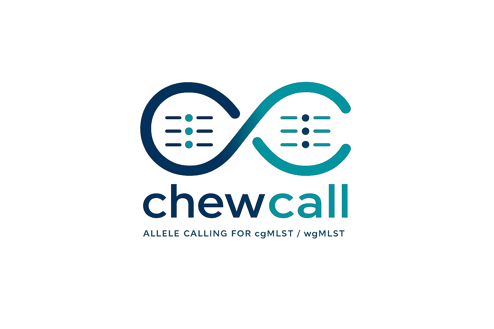

<p align="center">
  
</p>

# chewcall

A high-performance allele caller for cgMLST/wgMLST schemas, inspired by and compatible at the callable-DNA output level with [chewBBACA](https://github.com/B-UMMI/chewBBACA).

**chewcall** is a Rust reference instantiation of a schema-side audit framework for representative-based minimizer-filtered allele calling. It reimplements the AlleleCall algorithm structure of chewBBACA in Rust, replaces BLASTp with SIMD-accelerated exact Smith-Waterman protein alignment via [parasail](https://github.com/jeffdaily/parasail), and ships an auxiliary `schema_audit` binary that flags loci whose representative set is too sparse for the minimizer-overlap pre-filter to retain every schema allele.

On 8 BeONE benchmark datasets (~28.7 M callable cells under a shared pre-computed CDS protocol), chewcall runs **10.7–22.3× faster** than chewBBACA v3.5.4 while preserving **100 % DNA-sequence agreement** on bilaterally callable cells.

## Installation

### Requirements

- Rust 1.75+ (install via [rustup](https://rustup.rs/))
- [parasail](https://github.com/jeffdaily/parasail) (SIMD-accelerated Smith-Waterman library)
- Optional: CUDA 12+ and NVIDIA GPU (for `--gpu` mode)

### Build

```bash
# Build parasail (one-time)
git clone https://github.com/jeffdaily/parasail.git
cd parasail && mkdir build && cd build
cmake .. && make -j$(nproc)
cd ../..

# Pin a tagged release for reproducibility (recommended for paper benchmarks)
git checkout v0.1.0   # or any release tag; matches Cargo.lock under that tag

# Standard build
cargo build --release

# Optional: enable host-specific SIMD codegen for a small additional speedup
# (≤4% on the BeONE benchmarks; the published timings use the standard build above)
# RUSTFLAGS="-C target-cpu=native" cargo build --release

# With GPU support (requires CUDA)
CUDA_HOME=/usr/local/cuda cargo build --release

# Run (parasail must be in LD_LIBRARY_PATH)
LD_LIBRARY_PATH=/path/to/parasail/build ./target/release/chewcall [OPTIONS]
```

The binaries are at `target/release/chewcall` and `target/release/schema_audit`.

## Usage

### Quick start

```bash
# Run allele calling (built-in CDS prediction via prodigal-rs)
chewcall \
    -i /path/to/genomes \
    -g /path/to/schema \
    -o /path/to/output \
    --cpu 8

# Or with pre-computed CDS (pyrodigal, for exact comparison with chewBBACA)
python predict_cds.py \
    -i /path/to/genomes \
    -g /path/to/schema \
    -o /path/to/cds_output

chewcall \
    -i /path/to/genomes \
    -g /path/to/schema \
    -o /path/to/output \
    --cpu 8 \
    --cds-input /path/to/cds_output
```

### Full options

```
chewcall [OPTIONS] -i <INPUT> -g <SCHEMA> -o <OUTPUT>

Required:
  -i, --input <INPUT>                 Input directory with genome FASTA files
  -g, --schema <SCHEMA>               Schema directory (chewBBACA format)
  -o, --output <OUTPUT>               Output directory

Calling parameters:
      --bsr <BSR>                     BLAST Score Ratio threshold [default: 0.6]
      --size-threshold <SIZE>         Size threshold for ASM/ALM classification [default: 0.2]
      --min-length <MIN>              Minimum sequence length in bp [default: 0]
  -t, --translation-table <TT>        Genetic code [default: 11]

Minimizer pre-filter (Phase 4 candidate selection):
      --minimizer-k <K>               Minimizer k-mer size [default: 5]
      --minimizer-w <W>               Minimizer window size [default: 5]
      --minimizer-threshold <FRAC>    Minimum query-normalised minimizer-overlap (MO)
                                      a representative must reach to be retained
                                      [default: 0.2]. Lower this on schemas with
                                      high allelic diversity if some loci appear
                                      under-represented in the short/ subdirectory;
                                      run schema_audit first to identify them
                                      (see below).

Alignment backend:
      --mode <MODE>                   Alignment mode: "fast" (parasail SIMD) or
                                      "compatible" (BLASTp subprocess) [default: fast]
      --blastp-path <PATH>            Path to blastp binary (required for --mode compatible)
      --gpu                           Use GPU (CUDA) for Smith-Waterman alignment

CDS prediction:
      --cds-input <CDS_INPUT>         Directory with pre-computed CDS FASTA files
                                      (from predict_cds.py); skips built-in prodigal-rs
      --prodigal-path <PATH>          Path to prodigal binary (subprocess fallback)
      --prodigal-ffi                  Use the bundled libprodigal FFI instead of a
                                      subprocess (faster startup, requires training file)
      --prodigal-mode <MODE>          Prodigal mode: single | meta [default: single]

Runtime / output:
      --cpu <CPU>                     Number of CPU threads [default: 1]
      --update-schema                 Append novel alleles (INF) to the schema FASTA
                                      files in place. By default chewcall is read-only
                                      and writes novel alleles only to the output dir.
```

### Auditing a schema before a run (`schema_audit`)

A separate binary `schema_audit` is the reference implementation of the worst-case
minimizer-overlap (wcr) audit. For each locus of a chewBBACA schema it computes

$$\mathrm{wcr}(L_i; k, w) \;=\; \min_{a \in A_i} \max_{r \in R_i} \mathrm{MO}\bigl(\pi(a), \pi(r)\bigr),$$

where $\mathrm{MO}$ is the query-normalised minimizer overlap of the pre-filter,
$\pi$ is protein translation, $A_i$ is the locus's full allele set, and $R_i$ its
`short/` representative set. Loci with $\mathrm{wcr}(L_i) < \tau$ are flagged:
at least one of their schema alleles would be silently excluded by the
minimizer pre-filter at chewcall's calling threshold $\tau$. Running the audit
before a calling run lets schema curators expand $R_i$ (via `chewBBACA
CreateSchema`/`SchemaEvaluator`) on the flagged loci, or lower
`--minimizer-threshold`, before the silent loss shows up at runtime.

```bash
schema_audit \
    --schema /path/to/schema \
    --threshold 0.20 \
    --exclude-inferred \
    --out audit_report.tsv \
    --cpu 8
```

The TSV lists every locus with `n_reps`, `n_alleles`, `worst_recall`, the
identifier of the worst-recalled allele (the witness $a^\star$), and a `flagged`
column. The summary on stderr suggests either lowering `--minimizer-threshold`
for the next chewcall run or — preferably — expanding the representative set.
`--exclude-inferred` skips `*N`-prefixed alleles, which are by construction
outliers and rarely appear as actual query CDS.

### CDS prediction modes

chewcall supports four CDS prediction modes:

1. **Built-in prodigal-rs** (default) — Pure Rust reimplementation of Prodigal 2.6.3 (single mode). No external dependencies. Uses the `.trn` training file from the schema directory.
2. **Pre-computed CDS** (`--cds-input`) — Reads CDS from a directory of FASTA files pre-computed with pyrodigal or prodigal.
3. **External prodigal** (`--prodigal-path`) — Spawns prodigal as a subprocess for each genome.
4. **Bundled prodigal via FFI** (`--prodigal-ffi`) — Uses libprodigal linked into chewcall; faster startup than subprocess mode.

### Schema compatibility

chewcall works with any schema in the standard chewBBACA format:

```
schema/
├── locus1.fasta          # Full allele sequences
├── locus2.fasta
├── short/
│   ├── locus1_short.fasta  # Representative alleles
│   └── locus2_short.fasta
└── *.trn                 # Prodigal training file
```

Schemas can be downloaded from [Chewie-NS](https://chewbbaca.online/) or prepared with chewBBACA's `PrepExternalSchema` / `CreateSchema`.

```bash
chewBBACA.py DownloadSchema -sp <species_id> -sc <schema_id> -o schema_dir
```

### Output files

| File | Description |
|------|-------------|
| `results_alleles.tsv` | Allelic profiles (locus × genome matrix) |
| `results_alleles_hashed.tsv` | CRC32-hashed allelic profiles (via `crc32fast`) |
| `results_statistics.tsv` | Per-genome classification statistics |
| `loci_summary_stats.tsv` | Per-locus classification counts |
| `results_contigsInfo.tsv` | CDS coordinates on contigs |
| `novel_alleles.fasta` | Novel allele sequences (INF) |

## Method overview

chewcall instantiates a *filter-and-verify* pipeline at the cluster stage:

1. A minimizer-overlap pre-filter selects, for each query protein, a shortlist
   of representatives whose query-normalised minimizer overlap exceeds a
   threshold $\tau$ (default `0.20`), capped at the top $\kappa$ by descending
   overlap (default `30`). Both defaults match the hardcoded values inspected
   in chewBBACA v3.5.4.
2. Every retained representative is scored exactly via parasail's striped SIMD
   Smith-Waterman (BLOSUM62, gap open 11, gap extend 1), no BLAST involved.
3. The BSR (Rasko 2005) above-threshold representatives feed the standard
   chewBBACA eleven-class per-cell classifier (EXC / INF / NIPH / NIPHEM / ALM
   / ASM / PLOT3 / PLOT5 / LOTSC / PAMA / LNF).

The `schema_audit` binary characterises the loci on which step (1) is
structurally insufficient on the schema's own alleles, offline and once per
(schema, $(k, w, \tau)$).

See the paper (citation below) for the algorithmic formalisation, the
soundness/completeness lemma for the at-risk set $V_\tau$, and the
compositional correctness boundary theorem connecting filter retention to
pipeline equivalence against a brute-force exact-SW baseline.

## Paper

If you use chewcall or the schema-side audit in your work, please cite:

> A. de Ruvo, N. Radomski, A. Di Pasquale.
> **A schema-side audit of representative-based minimizer filtering in cgMLST/wgMLST allele calling.**
> WABI 2026 (submitted).

Companion reproduction scripts for the paper benchmarks are not part of this
public release; they are available on request from the authors.

## License

GPL-3.0 — same as the original [chewBBACA](https://github.com/B-UMMI/chewBBACA).

## Authors

GenPat Team — [Istituto Zooprofilattico Sperimentale dell'Abruzzo e del Molise](https://www.izs.it/)
